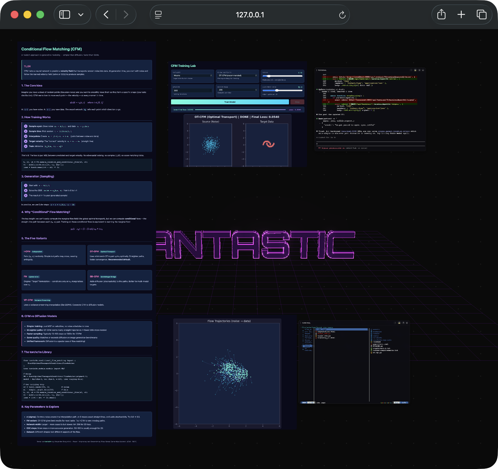

# Fantastic

A post-IDE editor — an infinite canvas where AI agents build anything.

## How it looks



A Fantastic environment created by Claude to help learn Conditional Flow Matching. I asked the coding agent to learn from `.fantastic`, read the handbook, find/clone and understand the CFM repo, and create explanation, training, and visualisation UI. A very fun and quick way to do self-presentations and learning sessions.

## Architecture

```
CLI / REST / WS ──→ Dispatch ──→ Engine ──→ .fantastic/
                        ↑                  ──→ PTY
                   Plugins                 ──→ Subprocess
              (@register_dispatch)
```

## Requirements

- [uv](https://docs.astral.sh/uv/) (Python package manager)
- Node.js 18+ (for frontend build)

```bash
# Install uv (macOS / Linux)
curl -LsSf https://astral.sh/uv/install.sh | sh

# Or via Homebrew
brew install uv
```

## Installation

```bash
# From source (recommended)
uv sync                                  # install Python 3.11+, deps, and venv
uv run fantastic                         # run directly

# Install globally
uv tool install .                        # from source
uv tool install fantastic                # from PyPI (after publish)

# Or with pip
pip install fantastic
```

## Usage

Start in the project dir. In console you will see url of your canvas

```bash
fantastic                    # start (auto-adds canvas on first run)
```

Double-click on free space to create a terminal. Launch your coding agent and ask it to read the `.fantastic/` folder and pull the handbook. Then the coding agent is ready to spawn HTML agents with two-way binding to the server, creating dynamic interfaces.

Agents live in `.fantastic/agents` as ephemeral entities. Visually they look like windows, but under the hood they may contain execution scripts and two-way bindings between themselves, all wired by coding agents.

It's possible to make weak bindings between Fantastic instances, start/stop from each other, and even create root control panels to run your Fantastics on different dirs and ports — try it, it's fun.

What happens next is limited only by your imagination. This process is similar to what you saw in Iron Man where Stark operated Jarvis. It is envisioned as a next-level IDE.

It can be 3D-based workflows, interface prototyping, musical creation, multi-agent orchestration.

Coding agents should be asked what they can do and described a task you want to accomplish. The most fantastic thing is how the coding agent, combining new skills, spawns parts of interface scaffolding. New buttons don't always work, but with some practice you'll feel that this tool can help you do everyday work, removing spatial limits and settings overload of a classical IDE. You scaffold your own applications here, assembling from zero.

## Security

Intended for personal use. Do not expose to the web — it can compromise your machine.

## License

Apache 2.0 — see [LICENSE](LICENSE).